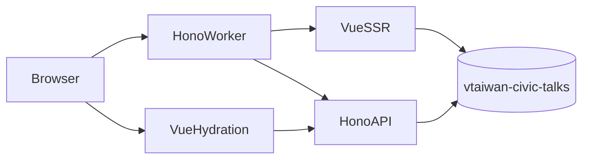

# Vue SSR 複刻 Civic Talk

## 架構與資料庫
- 在 [`/Users/bestian/Documents/GitHub/civic-talk-hono/wrangler.jsonc`](/Users/bestian/Documents/GitHub/civic-talk-hono/wrangler.jsonc) 設定 `DB` 綁定；執行 `wrangler d1 create vtaiwan-civic-talks`，將取得的 `database_id` 回填。
- 新增 [`/Users/bestian/Documents/GitHub/civic-talk-hono/migrations/0001_init.sql`](/Users/bestian/Documents/GitHub/civic-talk-hono/migrations/0001_init.sql)，建立 `ct_issues`、`ct_materials`、`ct_briefings`、`ct_opinions`，包含 FK、索引、`polis_id`、狀態/立場約束與原專案示範資料；套用至本機及遠端 D1。
- 在 [`/Users/bestian/Documents/GitHub/civic-talk-hono/src/db/queries.ts`](/Users/bestian/Documents/GitHub/civic-talk-hono/src/db/queries.ts) 集中 D1 查詢與資料型別，所有 SQL 僅使用 `ct_` 新表。

## Vue SSR 頁面與 Tailwind
- 更新 [`/Users/bestian/Documents/GitHub/civic-talk-hono/package.json`](/Users/bestian/Documents/GitHub/civic-talk-hono/package.json) 與 Vite 設定，導入 Tailwind；以舊 [`/Users/bestian/Documents/GitHub/civic-talk/public/style.css`](/Users/bestian/Documents/GitHub/civic-talk/public/style.css) 的民主紅、青玉綠、麥穗黃、字體與響應式規則轉成 Tailwind theme/utilities，不複製舊版大段手寫版面 CSS。
- 重建共用元件：品牌 Header/Footer、語言切換、IssueCard、StatusBadge、Tabs、表單、Toast、empty state；複製 `vtaiwan-logo.svg` 至新專案 public。
- 以 Vue SFC 重建 [`src/views/Home.vue`](/Users/bestian/Documents/GitHub/civic-talk-hono/src/views/Home.vue)、[`About.vue`](/Users/bestian/Documents/GitHub/civic-talk-hono/src/views/About.vue)，並新增 Issue、Contribute、Admin views，完整涵蓋首頁新增議題、議題四分頁、素材投稿、志願者 prompt、OPINION.md 下載、意見投稿、Polis embed 與管理 CRUD。
- 將 [`/Users/bestian/Documents/GitHub/civic-talk/public/i18n.js`](/Users/bestian/Documents/GitHub/civic-talk/public/i18n.js) 文案轉為 Vue i18n composable，保留中英切換與 `localStorage.civic_lang`；補齊舊 contribute 頁缺少的雙語。
- 擴充 SSR render/head 與 client entry 建置：首屏由 Worker 查 D1 後 SSR，互動頁 hydration，序列化 props 時做安全 escaping。

## 路由與 API
- 重構 [`/Users/bestian/Documents/GitHub/civic-talk-hono/src/index.ts`](/Users/bestian/Documents/GitHub/civic-talk-hono/src/index.ts)：提供 `/`、`/issues/:id`、`/contribute/:id`、`/about`、`/admin`；舊 `/index.html`、`/issue.html?id=`、`/contribute.html?id=`、`/about.html`、`/admin.html` 以 301/302 導向新路由。
- 新增 [`/Users/bestian/Documents/GitHub/civic-talk-hono/src/api/routes.ts`](/Users/bestian/Documents/GitHub/civic-talk-hono/src/api/routes.ts)，以型別化 Hono handlers 移植舊 [`functions/api/[[route]].js`](/Users/bestian/Documents/GitHub/civic-talk/functions/api/[[route]].js) 的 issues/materials/briefings/opinions/admin/stats/prompt endpoints、briefing 版本遞增、議題狀態轉換與級聯刪除。
- 保留 `ADMIN_PASSWORD` 與 `X-Admin-Token` 相容契約，補齊輸入驗證、404/400/401 回應及統一 JSON 錯誤；移除範本 `/word`、`/hundred`、`/api/hello` 與不再使用的範本元件/資產。

## 驗證
- 執行 `npm run typecheck`、`npm run build` 與 linter diagnostics。
- 以本機 D1/preview 驗證 SSR HTML、乾淨路由與舊網址導向；逐一 smoke test API CRUD、三種 prompt、狀態轉換、管理登入與刪除。
- 驗證中英切換、手機/桌面 Tailwind 排版、Hydration 無 mismatch、Polis 條件載入、OPINION.md 下載；最後查詢 `sqlite_master` 確認只新增 `ct_` 業務表並確認遠端 migration 成功。